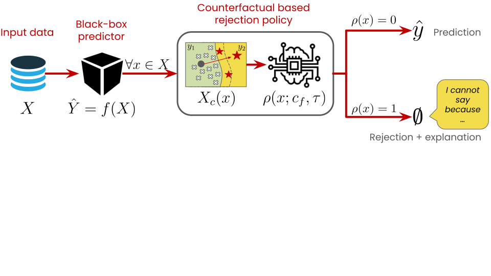

# Learning to Reject via LOcal Rule-based Explanations (L2R-LORE)

Learning to Reject via LOcal Rule-based Explanations (L2R-LORE) is a novel method that implements a dependent (i.e., function of the classifier’s output) and staged (i.e., learnt post-hoc with respect to the classifier)
abstention policy for the rejection of ambiguous samples. L2R-LORE is model agnostic with respect to ML models that solve binary and classification tasks using tabular data. Finally, L2R-LORE is interpretable by-design, since the
implemented abstention mechanism relies on a distance measure derived from stable local rule-based counterfactuals (LORE).

The contributions of L2D-LORE can be summarized as follows:
1. We present a novel strategy to fine-tune an existing pre-trained classifier with local rule-based explanations in order to better understand its decision boundary and improve its uncertainty estimates.
2. We used the distance between data points and their corresponding counterfactuals as a confidence metric to define a rejection policy for the given classifier.
3. We generate human-understandable explanations to accompany the outcome of the classifier in case of rejection.

A complete description of the method can be found here: https://www.overleaf.com/read/pwdschmbxhqj#1b2b66

